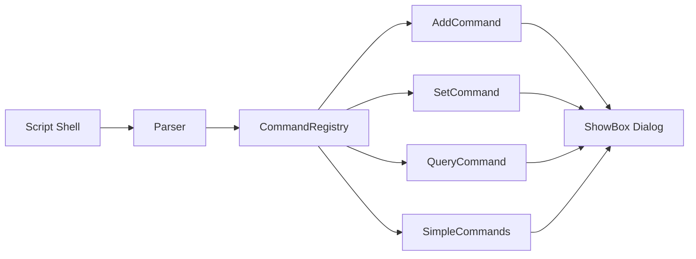

# Arquitetura do ShowBox

## Visão Geral

ShowBox é construído usando **C++17** e **Qt6**, seguindo uma arquitetura modular baseada em padrões de design orientados a objetos. A aplicação funciona como uma ponte entre scripts shell e componentes GUI Qt, processando comandos via linha de comando e construindo interfaces dinamicamente.

## Padrões Arquiteturais Principais

### 1. Command Pattern

O núcleo da arquitetura é o **Command Registry**, que implementa o padrão Command:



**Componentes**:

- `command.h` - Interface base para comandos
- `command_registry.{h,cpp}` - Registro e despachante de comandos
- `commands/` - Implementações concretas:
  - `add_command` - Adiciona widgets
  - `set_command` - Configura propriedades
  - `query_command` - Consulta estado
  - `simple_commands` - Comandos auxiliares

### 2. Strategy Pattern (Temas)

O `ThemeManager` implementa estratégias de temas:

```cpp
enum ThemeMode {
    System,  // Detecta do sistema
    Light,   // Tema claro
    Dark     // Tema escuro
};
```

### 3. Builder Pattern (Construção  de Diálogos)

`ShowBox::addXXX()` métodos funcionam como builders:

```cpp
ShowBox dialog;
dialog.addPushButton("OK", "btn_ok", true, true, true);
dialog.addTextBox("Nome", "txt_name", "", "Digite seu nome", false);
dialog.addListBox("Opções", "list_opts", true, true);
```

## Estrutura de Camadas

```diagram
┌─────────────────────────────────────────────┐
│  CAMADA DE APRESENTAÇÃO                     │
│  - showbox.cc (ShowBox class)               │
│  - dialog_*.cc (Slots, Parser, Options)     │
│  - Gerencia QDialog e layouts               │
└──────────────┬──────────────────────────────┘
               │
┌──────────────▼──────────────────────────────┐
│  CAMADA DE APLICAÇÃO                        │
│  - command_registry.cpp                     │
│  - parser.cpp / tokenizer.cpp               │
│  - parser_driver.cpp                        │
│  - execution_context.cpp                    │
└──────────────┬──────────────────────────────┘
               │
┌──────────────▼──────────────────────────────┐
│  CAMADA DE DOMÍNIO                          │
│  - commands/*.cpp (lógica de negócio)       │
│  - theme_manager.cpp                        │
│  - icon_helper.cpp                          │
└──────────────┬──────────────────────────────┘
               │
┌──────────────▼──────────────────────────────┐
│  CAMADA DE WIDGETS CUSTOMIZADOS             │
│  - custom_table_widget.h                    │
│  - custom_chart_widget.{h,cpp}              │
└──────────────┬──────────────────────────────┘
               │
┌──────────────▼──────────────────────────────┐
│  FRAMEWORK Qt6                              │
│  - QWidget, QDialog, QLayout                │
│  - QCharts, QSvg                            │
└─────────────────────────────────────────────┘
```

## Componentes de Código Principal

### ShowBox Core (`showbox.{cc,h}`)

**Responsabilidades**:

- Gerenciamento da janela principal (`QDialog`)
- Coordenação de layouts (vertical/horizontal)
- Criação dinâmica de widgets
- Gerenciamento de estado da aplicação
- Comunicação com stdout para retornar valores

**Principais Métodos** (~52 funções):

- `addPushButton()`, `addCheckBox()`, `addRadioButton()` - Botões
- `addTextBox()`, `addListBox()`, `addComboBox()` - Entrada
- `addLabel()`, `addSeparator()` - Elementos visuais
- `addGroupBox()`, `addFrame()` - Contêineres
- `addTabs()`, `addPage()` - Navegação
- `addTable()`, `addChart()` - Dados complexos
- `addCalendar()`, `addProgressBar()`, `addSlider()` - Especializados

### Parser e Tokenizer

```flow
Input: "showbox --title \"Test\" --add-button \"OK\""
       │
       ▼
[Tokenizer] → Tokens: ["showbox", "--title", "Test", "--add-button", "OK"]
       │
       ▼
[Parser] → AST de comandos
       │
       ▼
[ParserDriver] → Execução sequencial
```

**Arquivos**:

- `tokenizer.{h,cpp}` - Quebra argumentos CLI em tokens
- `parser.{h,cpp}` - Analisa sintaxe e monta estrutura de comandos
- `parser_driver.{h,cpp}` - Orquestra parsing e execução

### System de Comandos

Cada comando implementa a interface base:

```cpp
class Command {
public:
    virtual void execute(ExecutionContext& ctx) = 0;
};
```

**Tipos de Comandos**:

1. **AddCommand** - Adiciona elementos ao diálogo
2. **SetCommand** - Configura propriedades (título, tamanho, tema)
3. **QueryCommand** - Consulta valores de widgets
4. **SimpleCommands** - Operações auxiliares (clear, step, end)

### Widgets Customizados

#### CustomTableWidget

- Baseado em `QTableWidget`
- Funcionalidades: busca integrada, seleção de linhas
- Carregamento de dados de arquivos CSV/TSV

#### CustomChartWidget  

- Baseado em `QtCharts::QChart`
- Suporte a múltiplos tipos de gráficos
- Renderização de dados dinâmicos

### Helpers e Utilitários

**ThemeManager** (`theme_manager.{h,cpp}`):

- Detecção automática de tema do sistema
- Aplicação de paletas Qt
- Suporte a temas personalizados

**IconHelper** (`icon_helper.{h,cpp}`):

- Carregamento de ícones de arquivos
- Suporte a ícones tema do sistema
- Cache de ícones para performance

**Logger** (`logger.{h,cpp}`):

- Sistema de logging básico
- Debug de operações internas

## Fluxo de Execução

### 1. Inicialização

```flow
main()
  ├─> QApplication init
  ├─> ShowBox constructor
  ├─> ThemeManager setup
  └─> Parser init
```

### 2. Processamento de Comandos

```flow
ParserDriver.parse(args)
  ├─> Tokenizer.tokenize()
  ├─> Parser.buildCommandTree()
  └─> Para cada comando:
      ├─> CommandRegistry.getCommand()
      └─> Command.execute(context)
          └─> ShowBox.addWidget() / setProperty()
```

### 3. Exibição e Interação

```flow
ShowBox.exec()
  ├─> QDialog.show()
  ├─> Event Loop Qt
  ├─> User interaction
  └─> Button clicked
      ├─> emit signal
      ├─> slot processado
      └─> output para stdout
```

### 4. Finalização

```flow
Dialog closed
  ├─> Valores coletados
  ├─> Formatação de output
  ├─> fprintf(stdout)
  └─> exit(0)
```

## Gerenciamento de Layouts

ShowBox usa um sistema de pilha de layouts:

```cpp
QVBoxLayout *mainLayout;     // Layout principal
QHBoxLayout *currentRow;     // Linha atual
QVBoxLayout *currentColumn;  // Coluna atual
```

**Navegação**:

- `stepHorizontal()` - Move para próxima coluna
- `stepVertical()` - Move para próxima linha
- `endPage()` / `endTabs()` - Fecha contextos

## Gerenciamento de Estado

**ExecutionContext** mantém:

- Referência ao `ShowBox`
- Estado atual de parsing
- Contexto de widgets ativos
- Flags de configuração

## Sistema de I/O

### Input (stdin)

- Leitura de tabelas de arquivos
- Carregamento de dados para charts
- Comandos em modo interativo (planejado)

### Output (stdout)

- Valores de widgets (`--query`)
- Seleções de listas/tabelas
- Estados de checkboxes/radiobuttons
- Dados de calendário/sliders

**Formato de Output**:

```var
widget_name=valor
list_item=item_selecionado
checkbox_state=true
```

## Build System (qmake)

Arquivo `showbox.pro`:

```qmake
TEMPLATE = app
CONFIG += qt thread release c++17
QT += widgets svg charts

HEADERS += showbox.h ...
SOURCES += showbox.cc ...

# Geração automática de man page
man_page.commands = pandoc -s -f markdown -t man ...
```

**Artefatos**:

- `src/code/showbox/bin/` - Binário compilado
- `src/code/showbox/obj/` - Objetos intermediários
- `MAN/` - Man pages geradas

## Dependências Externas

### Qt6 Modules

- `QtWidgets` - Componentes GUI base
- `QtSvg` - Ícones e imagens SVG
- `QtCharts` - Gráficos e visualizações

### Build Tools

- `qmake6` - Build system
- `moc` - Meta-Object Compiler (Qt)
- `pandoc` - Geração de documentação

## Considerações de Design

### Thread Safety

- Aplicação single-threaded (GUI thread)
- Event loop Qt gerencia concorrência

### Memory Management

- Qt parent-child ownership
- Widgets deletados automaticamente quando parent é destruído
- Mínimo uso de `new`/`delete` manual

### Extensibilidade

- Novos widgets = novo método `addXXX()`
- Novos comandos = nova classe em `commands/`
- Novos temas = extensão de `ThemeManager`

### Performance

- Lazy loading de widgets
- Cache de ícones
- Renderização sob demanda (charts)

## Pontos de Extensão

### Adicionar Novo Widget

1. Adicionar método em `showbox.h`:

   ```cpp
   void addMyWidget(const char *name, ...);
   ```

2. Implementar em `showbox.cc`

3. Criar comando correspondente em `commands/`

4. Registrar em `CommandRegistry`

### Adicionar Novo Tema

1. Estender `ThemeManager::ThemeMode`
2. Implementar paleta em `applyTheme()`
3. Adicionar opção CLI no parser

---

*Esta arquitetura é projetada para ser modular, extensível e manter compatibilidade com a interface CLI estável.*
