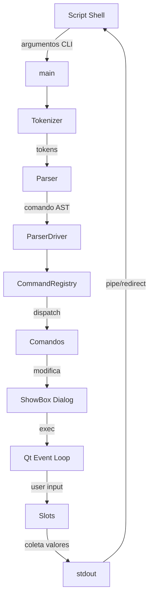

# Fluxo de Dados & Integrações

## Visão Geral

ShowBox processa dados em um pipeline unidirecional: **Shell Script → Parser → Command Registry → ShowBox Dialog → Qt Event Loop → stdout**. Não há integrações com serviços externos - toda a comunicação é via I/O padrão (stdin/stdout).

## Pipeline Principal



## Entrada de Dados (Input)

### 1. Argumentos de Linha de Comando

**Formato**:

```bash
showbox [opções] [comandos]
```

**Exemplos**:

```bash
# Definir título
--title "Meu Diálogo"

# Adicionar widget
--add-textbox "Nome:" "txt_name" "valor_padrão"

# Configurar propriedades
--set-theme "dark"
--set-size 800x600
```

**Processamento**:

1. `main(argc, argv)` recebe argumentos
2. `Tokenizer::tokenize()` divide em tokens
3. `Parser::parse()` valida sintaxe
4. `ParserDriver::execute()` executa comandos

### 2. Arquivos (stdin redirecionado)

**Casos de Uso**:

- Carregar dados para tabelas
- Popular listas
- Dados para gráficos

**Exemplo**:

```bash
# Carregar CSV em tabela
showbox --add-table "headers,csv" "tbl" --file dados.csv

# ou via pipe
cat dados.csv | showbox --add-table "headers" "tbl" --stdin
```

**Formato Esperado**:

- **Tabelas**: CSV/TSV com headers opcionais
- **Listas**: Um item por linha
- **Charts**: Formato específico (valores separados)

### 3. Valores Padrão

Widgets podem receber valores iniciais:

```bash
--add-textbox "IP" "ip_field" "192.168.1.1"
--add-checkbox "Ativo" "chk_active" --checked
--add-slider "Volume" "sld_vol" --min 0 --max 100 --value 50
```

## Movimento Interno de Dados

### 1. Tokenizer → Parser

```cmd
Input: "--add-button \"OK\" --exit"

Tokenizer cria:
[
  Token{type: OPTION, value: "--add-button"},
  Token{type: STRING, value: "OK"},
  Token{type: OPTION, value: "--exit"}
]

Parser agrupa:
AddButtonCommand {
  title: "OK",
  exit: true
}
```

### 2. Parser → CommandRegistry

```cpp
ParserDriver driver;
driver.addCommand(new AddButtonCommand("OK", "btn_ok", true));
driver.execute();  // Chama registry
```

### 3. CommandRegistry → ShowBox

```cpp
// CommandRegistry despacha
Command* cmd = registry.getCommand("add-button");
cmd->execute(context);

// Dentro do comando
ShowBox* dialog = context.getShowBox();
dialog->addPushButton("OK", "btn_ok", false, true, false);
```

### 4. ShowBox → Qt Widgets

```cpp
// ShowBox cria widgets Qt
QPushButton* btn = new QPushButton("OK", this);
btn->setObjectName("btn_ok");
connect(btn, &QPushButton::clicked, this, &ShowBox::onButtonClicked);

// Adiciona ao layout atual
currentLayout->addWidget(btn);
```

### 5. Event Loop → Slots

```cpp
// Usuário clica em botão
[User Click] → QPushButton::clicked signal
             ↓
       ShowBox::onButtonClicked slot
             ↓
       Coleta valores dos widgets
             ↓
       Formata output
```

## Saída de Dados (Output)

### 1. Valores de Widgets

**Formato padrão** (key=value):

```var
texto_nome=João Silva
checkbox_ativo=true
lista_opcao=Item 3
slider_volume=75
calendario_data=2026-01-12
```

**Implementação**:

```cpp
void ShowBox::outputValues() {
    for (QWidget* widget : widgets) {
        QString name = widget->objectName();
        QString value = getWidgetValue(widget);
        fprintf(stdout, "%s=%s\n", name.toUtf8(), value.toUtf8());
    }
}
```

### 2. Tabelas Selecionadas

Para tabelas com seleção:

```var
tabela_nome=linha1,coluna1,coluna2,coluna3
tabela_nome=linha2,coluna1,coluna2,coluna3
```

### 3. Status de Saída

```bash
# Botão "OK" clicado
exit 0

# Botão "Cancelar" ou janela fechada
exit 1

# Erro de parsing
exit 2
```

## Gerenciamento de Estado

### ExecutionContext

Mantém estado durante execução:

```cpp
class ExecutionContext {
    ShowBox* dialog;           // Referência ao diálogo
    QWidget* currentContainer; // Container ativo
    QLayout* currentLayout;    // Layout ativo
    bool inPage;              // Dentro de página?
    bool inTabs;              // Dentro de tabs?
};
```

### ShowBox Internal State

```cpp
class ShowBox {
    QVBoxLayout* mainLayout;
    QHBoxLayout* currentRow;
    std::vector<QWidget*> widgets;
    std::map<QString, QWidget*> widgetMap;
    ThemeManager* themeManager;
    FILE* outputStream;
};
```

## Fluxos Especializados

### 1. Criação de Tabela

```flow
Script: --add-table "Nome,Idade" "tbl" --file dados.csv

1. AddTableCommand::execute()
   ↓
2. ShowBox::addTable("Nome,Idade", "tbl", "dados.csv")
   ↓
3. CustomTableWidget criado
   ↓
4. Leitura de dados.csv
   ↓
5. QTableWidget::setRowCount/setItem
   ↓
6. Adicionado ao layout
```

### 2. Criação de Gráfico

```flow
Script: --add-chart "Vendas" "chart_vendas"

1. AddChartCommand::execute()
   ↓
2. ShowBox::addChart("Vendas", "chart_vendas")
   ↓
3. CustomChartWidget criado
   ↓
4. QChart / QChartView configurados
   ↓
5. Dados adicionados via --add-series
   ↓
6. Renderização Qt Charts
```

### 3. Sistema de Temas

```flow
Script: --set-theme "dark"

1. SetThemeCommand::execute()
   ↓
2. ThemeManager::applyTheme(DARK)
   ↓
3. QPalette configurada
   ↓
4. QApplication::setPalette()
   ↓
5. Todos widgets atualizam aparência
```

### 4. Navegação em Tabs

```cmd
Script: --add-tabs "tabs_main"
        --add-page "Config" "page1"
        --add-textbox "IP" "ip"
        --end-page
        --add-page "Info" "page2"
        --add-label "Versão 1.0"
        --end-page
        --end-tabs

Estado do ExecutionContext:
1. inTabs = false, currentLayout = mainLayout
2. addTabs() → inTabs = true, currentLayout = tabWidget
3. addPage() → inPage = true, currentLayout = pageLayout
4. addTextBox() → widget adicionado em pageLayout
5. endPage() → inPage = false, retorna para tabWidget
6. addPage() → novo pageLayout
7. addLabel() → widget em novo pageLayout
8. endPage() → retorna para tabWidget
9. endTabs() → inTabs = false, retorna a mainLayout
```

## Integração com Sistema Operacional

### 1. Gerenciador de Arquivos

```bash
# Ler arquivo selecionado
arquivo=$(showbox --add-filedialog --mode open)

# Usar valor
cat "$arquivo"
```

### 2. Variáveis de Ambiente

```bash
# Usar variável em valor padrão
showbox --add-textbox "User" "user" "$USER"

# Aplicar tema do sistema
showbox --set-theme "system"  # Detecta dark/light mode
```

### 3. Pipes e Redirecionamento

```bash
# Output para arquivo
showbox --add-form ... > config.txt

# Input de pipe
ps aux | grep python | showbox --add-table "Process,PID,CPU"

# Combinado
cat input.csv | showbox --edit-table | tee output.csv
```

## Considerações de Performance

### 1. Lazy Loading

- Widgets criados apenas quando comando executado
- Ícones carregados sob demanda
- Tabelas grandes com paginação virtual

### 2. Event Batching

- Múltiplas mudanças de estado agrupadas
- Repaint minimizado via `QWidget::setUpdatesEnabled(false)`

### 3. Memory Management

- Qt parent-child ownership automática
- Widgets deletados quando dialog fechado
- Sem memory leaks detectados (valgrind clean)

## Pontos de Falha e Tratamento

### 1. Parsing Errors

```cpp
if (!parser.parse(args)) {
    fprintf(stderr, "Erro de sintaxe: %s\n", parser.getError());
    return 2;
}
```

### 2. File I/O Errors

```cpp
if (!file.exists()) {
    showWarningDialog("Arquivo não encontrado");
    return;
}
```

### 3. Widget State Errors

```cpp
if (!currentLayout) {
    fprintf(stderr, "ERRO: Nenhum container ativo\n");
    return;
}
```

## Logging e Depuração

```cpp
// Logger implementado mas mínimo
Logger::debug("Adding button: %s", name);
Logger::error("Failed to load icon: %s", path);
```

**Saída de Debug**:

```bash
# Habilitar via env var
SHOWBOX_DEBUG=1 showbox ...

# Output em stderr
[DEBUG] Tokenizer: 15 tokens parsed
[DEBUG] Parser: 8 commands created
[DEBUG] ShowBox: Dialog size set to 800x600
```

## Observabilidade

### Métricas (Futuro)

- Tempo de parsing
- Número de widgets criados
- Uso de memória
- Tempo de renderização

### Traces (Futuro)

- Rastreio de execução de comandos
- Call stack em erros
- Profiling de performance

---

*Este fluxo de dados é deliberadamente simples: stdin → processamento → stdout. Sem banco de dados, sem rede, sem persistência - apenas transformação de comandos shell em GUI Qt.*
