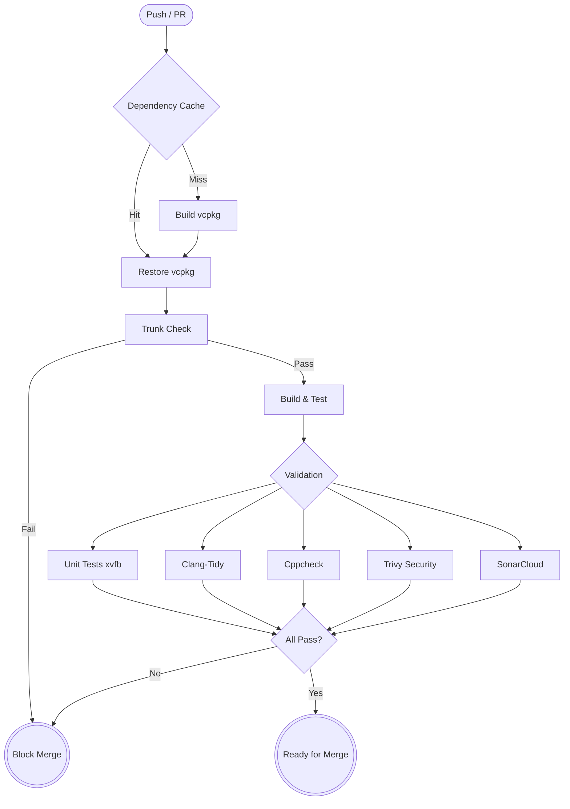
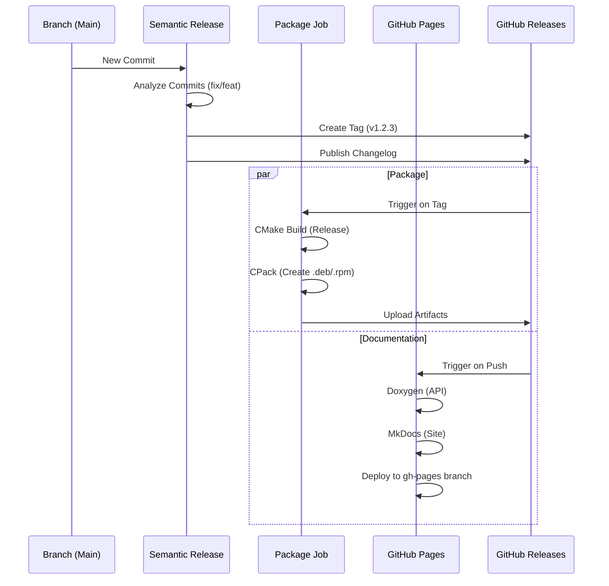

# SHantilly & SHantilly-Studio: Technical Overview & Ecosystem Analysis

## 1. Executive Summary
The SHantilly ecosystem has been successfully modernized into a state-of-the-art C++ development environment. It leverages **Infrastructure as Code (IaC)** principles for its tooling, ensuring that the local development environment matches the CI/CD pipeline exactly. This "Shift Left" approach (finding issues locally before CI) is powered by **Trunk** and **vcpkg**.

The project is **highly optimized for AI Agents**. The existence of explicit manifest files (`vcpkg.json`, `trunk.yaml`) and a dedicated `AGENTS.md` means that any LLM can understand the projects contracts without hallucinating commands.

---

## 2. Toolchain & Ecosystem

The following tools form the backbone of the project. Each was chosen for reproducibility and automation.

| Category | Tool | Role | Why it helps Agents |
| :--- | :--- | :--- | :--- |
| **Dependency Mgmt** | **vcpkg** (Manifest Mode) | Manages Qt6, QtCharts, QtSVG, and GTest versions automatically. | No complex installation scripts. `vcpkg install` just works based on `vcpkg.json`. |
| **Linting & Formatting** | **Trunk** | Orchestrates `clang-format`, `clang-tidy`, `cmake-format`, `shellcheck`, `yamllint`. | Agents run ONE command (`trunk check`) instead of memorizing 5 different linter syntaxes. |
| **Build System** | **CMake** + **Make** | Configures and compiles the project. | Standard, declarative build definitions (`CMakeLists.txt`) are easy for LLMs to parse. |
| **Testing** | **GoogleTest** / **QtTest** | Unit and Integration testing. | Standard frameworks that Agents are well-trained on. |
| **Containers** | **Docker** | Provides a reproducible "Developer Box" environment. | Ensures code written by an Agent works exactly the same as on the user's machine. |
| **Documentation** | **Doxygen** + **MkDocs** | Generates API docs (C++) and User Guides (Markdown). | Separates code docs (structured) from guides (narrative), easier to maintain. |
| **Release** | **Semantic Release** | Automates versioning (v1.0.0 -> v1.1.0) and changelogs. | Removes the burden of manual tagging from the human/agent workflow. |

---

## 3. Pipeline Architecture (Visualized)

### A. The "Quality Gate" CI Pipeline (`ci.yml`)
Every Push/PR triggers this rigorous pipeline. It forces high quality before any code merges.

### B. The Release & Package Pipeline (`release.yml` + `package.yml`)
Once merged to `main`, the ecosystem automatically delivers the software.

---

## 4. Agent Friendliness Assessment

**Verdict: 🟢 EXCELLENT**

You asked if this structure is simple for AI Agents with limited context to understand. **The answer is a resounding YES.**

### Why?
1.  **Context Efficiency**: An agent does **not** need to read the entire source code to know how to build it. It only needs to read `AGENTS.md` (approx. 500 tokens).
2.  **Explicit Contracts**:
    *   *Need dependencies?* -> Read `vcpkg.json`.
    *   *Need to check code style?* -> Run `trunk check`.
    *   *Need to build?* -> Run `make build`.
3.  **Low Hallucination Risk**: Because the tools (`vcpkg`, `trunk`) standardize the environment, an Agent doesn't need to "guess" if you are using `apt-get`, `brew`, or `pacman`. It just uses the project-local tools.
4.  **Self-Correcting**: If an Agent writes bad code, `trunk check` provides JSON-formatted outputs that are easy for an Agent to parse and fix automatically, without needing human intervention.

### Recommendation for Future Agents
When prompting a new Agent (e.g., a "Junior Developer" bot), simply provide them with the content of `AGENTS.md`. That single file contains 99% of the instructions they need to be productive in this repository.
